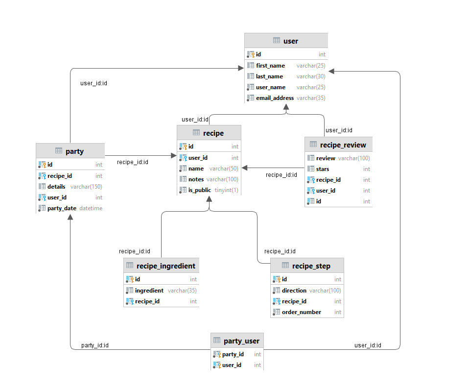

### User Table:
- UserID(int autoincrement)* not null
- Username(varchar) not null
- FirstName(varchar) not null
- LastName(varchar) not null
- EmailAddress(varchar) not null

### Recipe Table
- ID(int autoincrement)* not null
- UserID(int)! not null
- Name(varchar) not null
- IsPublic(boolean) not null
- Notes(varchar)

## RecipeIngredient Table
- ID(int autoincrement)* not null
- RecipeID(int)! not null
- IngredientName(varchar)* not null

## RecipeStep Table
- ID(int autoincrement)* not null
- RecipeID(int)! not null
- OrderNumber(int)* not null
- Direction(varchar) not null

### RecipeReview Table
- ID(int autoincrement)* not null
- RecipeID(int)! not null
- UserID(int)! not null
- Stars(int)
- Review(varchar)

### Party Table
- ID(int autoincrement)* not null
- UserID (int)! not null
- RecipeID(int)! not null
- PartyDate (DateTime) not null
- Details (varchar) null

### PartyUser Table
- UserID(int)*! not null
- PartyID(int)*! not null

#### * denotes Primary Key
#### ! denotes Foreign Key